# Privacy-Preserving Face Anonymization with Utility Retention

**ICLR-style project report**

**Authors:** Purav Shah, 202518020; Rajvi Burad, 202518048

## Abstract

Face images shared online can be matched by modern face-recognition systems even when the person is not named. This project studies the problem of **identity anonymization**: given a face image, create a new image that still looks natural to humans but no longer preserves the same biometric identity for automated recognition models.

The baseline for this work is **PrIdentity: Generalizable Privacy-Preserving Adversarial Perturbations for Anonymizing Facial Identity**. PrIdentity shows that adaptive Lp-norm adversarial perturbations can suppress identity while preserving visual utility. Starting from that motivation, this repository explores three different approaches:

1. **Sinusoidal Perturbation with ArcFace/ResNet**
2. **PRISM: Privacy-Preserving Riemannian Identity Suppression**
3. **PrimeShield v2: Adaptive Lp + MI-FGSM + Prime-Residue Targeting**

This report first presents the PrIdentity baseline, then describes each proposed approach independently with its architecture, mathematical formulation, visual outputs, and recorded results.

---

## 1. Introduction

Modern face-recognition networks map a face image $I$ to an embedding vector:

$$z = \phi(I)$$

Two images are treated as the same identity when their embeddings are close. For example, cosine similarity is commonly used:

$$\cos(z_1, z_2) = \frac{z_1 \cdot z_2}{\|z_1\| \|z_2\|}$$

The goal of this project is to generate an anonymized image $A$ such that:

- $A$ is visually close to the original image $I$,
- $\phi(A)$ is far from $\phi(I)$,
- the anonymization works beyond only one white-box model.

Most methods follow the same high-level form:

$$A = \mathrm{clip}(I + P)$$

where $P$ is a learned or optimized perturbation. The difficulty is not only creating a perturbation, but creating the **right perturbation**: one that hides identity without destroying image quality.

---

## 2. Baseline: PrIdentity

### 2.1 Motivation

PrIdentity argues that a good face anonymization method should satisfy three requirements:

| Requirement | Meaning |
|---|---|
| Privacy | Face-recognition systems should fail to match the anonymized face with the original identity |
| Data utility | The anonymized image should still look realistic and usable |
| Generalizability | The method should transfer to unseen recognition models |

Earlier anonymization methods often focused on only one or two of these requirements. Generative methods can hide identity, but they may visibly change facial attributes. Fixed-norm adversarial methods can preserve appearance, but they may overfit to one model or use a perturbation norm that is too rigid.

### 2.2 PrIdentity Architecture

  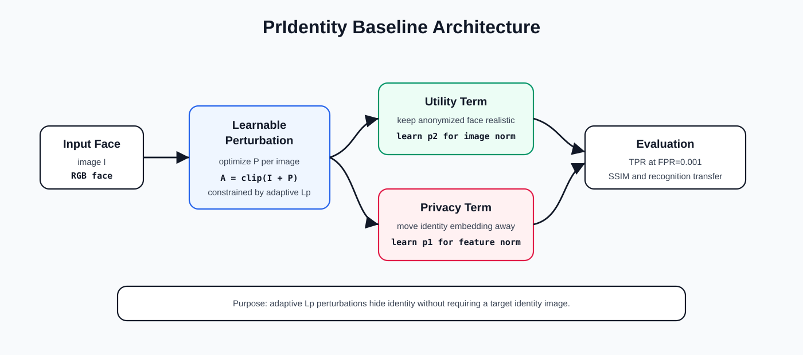

**Figure 1.** PrIdentity baseline architecture. The method optimizes a perturbation while balancing privacy and utility through adaptive Lp-norm regularization.

### 2.3 Method

PrIdentity anonymizes a face by learning a perturbation:

$$A = I + P$$

A frozen face-recognition model extracts embeddings:

$$z_I = \phi(I), \qquad z_A = \phi(A)$$

The privacy objective pushes $z_A$ away from $z_I$. The utility objective keeps $A$ close to $I$. The key idea is the adaptive Lp norm:

$$\|x\|_p = \left(\sum_i |x_i|^p\right)^{1/p}$$

Instead of fixing $p=1$ or $p=2$, PrIdentity learns the norm behavior. This allows the perturbation to adapt between sparse localized changes and smoother distributed changes.

### 2.4 PrIdentity Paper Results

The PrIdentity paper reports results on LFW at FPR $= 0.001$:

| Method | FaceNet TPR ↓ | ArcFace TPR ↓ | SSIM ↑ | Needs Target Identity |
|---|---:|---:|---:|---|
| No anonymization | 0.9650 | 0.9870 | 1.0000 | No |
| LIVE | 0.0350 | 0.0250 | — | Yes |
| CIAGAN | 0.0330 | 0.0190 | — | Yes |
| RIDDLE | 0.0320 | 0.0110 | — | Yes |
| G2Face | 0.0090 | 0.0070 | — | Yes |
| DIM | — | 0.0420 | — | No |
| MT-DIM | — | 0.0400 | — | No |
| TIP-IM | — | 0.0260 | — | No |
| **PrIdentity** | **0.0190** | **0.0020** | **0.8422** | **No** |

PrIdentity is therefore a strong baseline because it achieves very low verification TPR without needing a target identity. However, its SSIM leaves room for improving visual utility.

---

## 3. Approach 1: Sinusoidal Perturbation with ArcFace and ResNet

**Notebook:** `sin+arcface+resnet.ipynb`

### 3.1 Method Overview

The first approach keeps the adversarial perturbation idea but changes how the perturbation starts and how it is optimized. Instead of using random noise, the method initializes $P$ with smooth sinusoidal waves. This gives the perturbation a structured low-to-mid frequency pattern before gradient optimization begins.

### 3.2 Architecture

  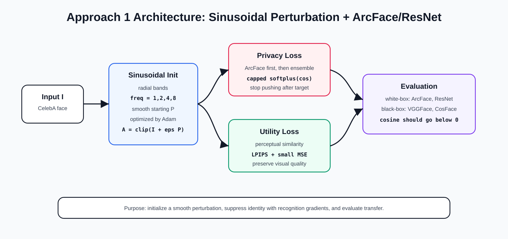

**Figure 3.** Architecture of Approach 1. A sinusoidal perturbation is optimized using identity loss from face-recognition models and utility loss from perceptual similarity.

### 3.3 Mathematical Formulation

The sinusoidal initialization is:

$$P_{\mathrm{raw}}(i,j) = \sum_k A_k \sin\!\left(\omega_k\, r(i,j) + \phi_k\right)$$

where:

- $r(i,j)$ is the radial distance from the image center,
- $\omega_k$ are frequency values,
- $\phi_k$ is a random phase,
- $A_k$ is the amplitude.

The anonymized image is:

$$A = \mathrm{clip}(I + \epsilon P,\; 0,\; 1)$$

The privacy loss uses cosine similarity:

$$s = \cos\!\left(\phi(I),\, \phi(A)\right)$$

The capped softplus privacy objective is:

$$\mathcal{L}_{\mathrm{priv}} =
\begin{cases}
0, & s \leq \tau \\
\mathrm{softplus}\!\left(k(s - \tau)\right), & s > \tau
\end{cases}$$

The utility loss is:

$$\mathcal{L}_{\mathrm{util}} = \mathrm{LPIPS}(I, A) + 0.001\,\|I - A\|_2^2$$

The final objective is:

$$\mathcal{L} = \mathcal{L}_{\mathrm{priv}} + \lambda\, \mathcal{L}_{\mathrm{util}}$$

### 3.4 Implementation Details

The notebook first attacks ArcFace as a white-box model and then checks transfer to CosFace. After that, the method is extended to a multi-surrogate setting:

| Stage | Description |
|---|---|
| Single-surrogate | Optimize against ArcFace and test on CosFace |
| Multi-surrogate | Optimize against ArcFace and ResNet-style model |
| Transfer check | Evaluate on ArcFace, ResNet, VGGFace, and CosFace |

### 3.5 Visualizations

  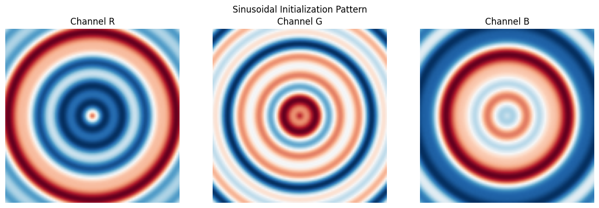

**Figure 4.** Sinusoidal initialization used before optimization.

  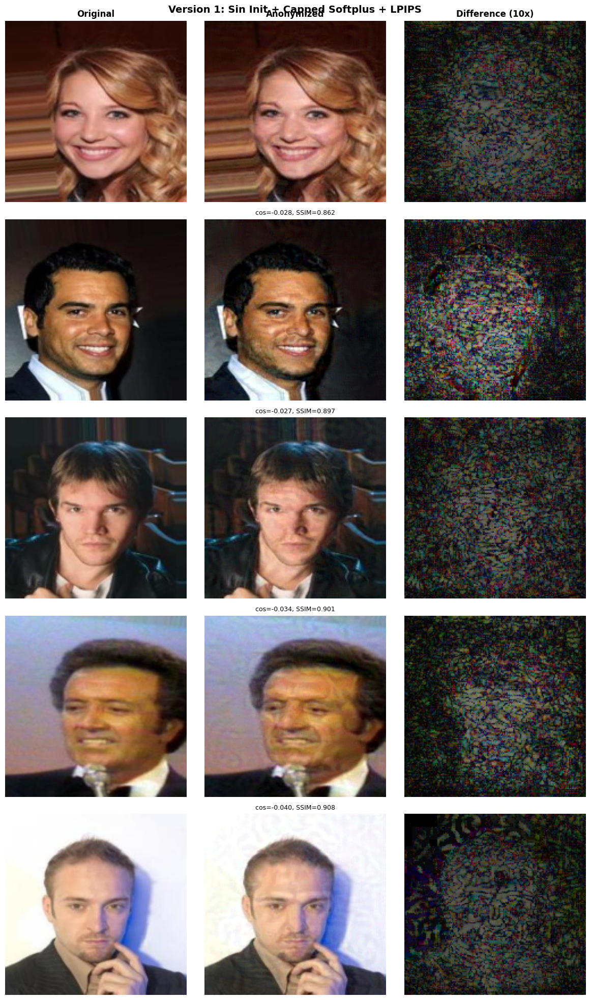

**Figure 5.** Qualitative results showing original images, anonymized images, and amplified perturbations.

  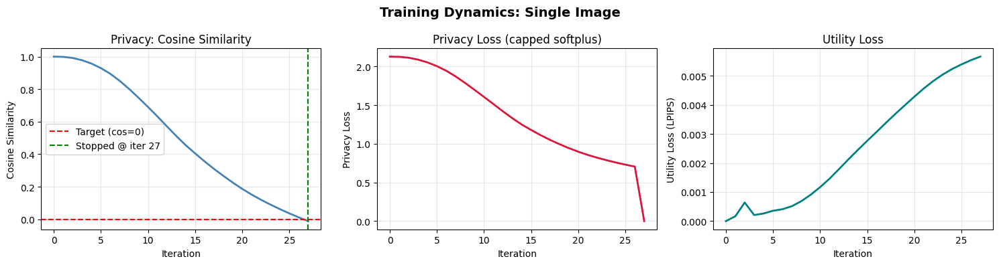

**Figure 6.** Optimization dynamics for privacy and utility.

### 3.6 Results

Single-surrogate test on 200 images:

| Metric | Result |
|---|---:|
| ArcFace cosine similarity ↓ | $-0.0426 \pm 0.0279$ |
| CosFace cosine similarity ↓ | $0.7324 \pm 0.1045$ |
| SSIM ↑ | $0.9011 \pm 0.0238$ |
| LPIPS ↓ | $0.0059 \pm 0.0012$ |
| MSE ↓ | $0.0005 \pm 0.0002$ |
| Mean iterations | $31.05 \pm 7.36$ |
| SSIM $> 0.85$ | 195 / 200 |
| ArcFace cosine $< 0$ | 200 / 200 |
| CosFace cosine $< 0$ | 0 / 200 |

Multi-surrogate test on 20 images:

| Model | Cosine Similarity ↓ | Cosine $< 0$ | Cosine $< 0.3$ |
|---|---:|---:|---:|
| ArcFace | $-0.0469 \pm 0.0230$ | 20 / 20 | 20 / 20 |
| ResNet | $-0.0785 \pm 0.0494$ | 20 / 20 | 20 / 20 |
| VGGFace | $-0.0469 \pm 0.0230$ | 20 / 20 | 20 / 20 |
| CosFace | $-0.0785 \pm 0.0494$ | 20 / 20 | 20 / 20 |
| SSIM ↑ | $0.8626 \pm 0.0318$ | — | — |

  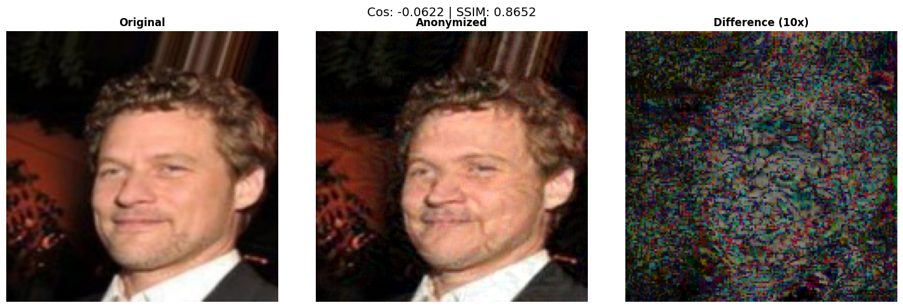

**Figure 7.** Multi-surrogate result. The shown sample has cosine similarity below zero for all tested models.

### 3.7 Interpretation

Approach 1 shows that initialization and surrogate choice are important. With only ArcFace, the method anonymizes the white-box ArcFace model but does not transfer to CosFace. With multiple surrogates, transfer improves across the tested models, although SSIM decreases. The method is most effective when multiple recognition models are available during optimization.

---

## 4. Approach 2: PRISM

**Notebook:** `prism-face-anonymization (2).ipynb`

### 4.1 Method Overview

PRISM stands for **Privacy-Preserving Riemannian Identity Suppression with Multi-Frequency Perturbation Learning**. The motivation is that identity information is not equally distributed across pixels or frequencies. A perturbation should therefore know:

- which frequency bands to modify,
- which embedding directions are identity-sensitive,
- how to preserve image structure while changing identity.

### 4.2 Architecture

  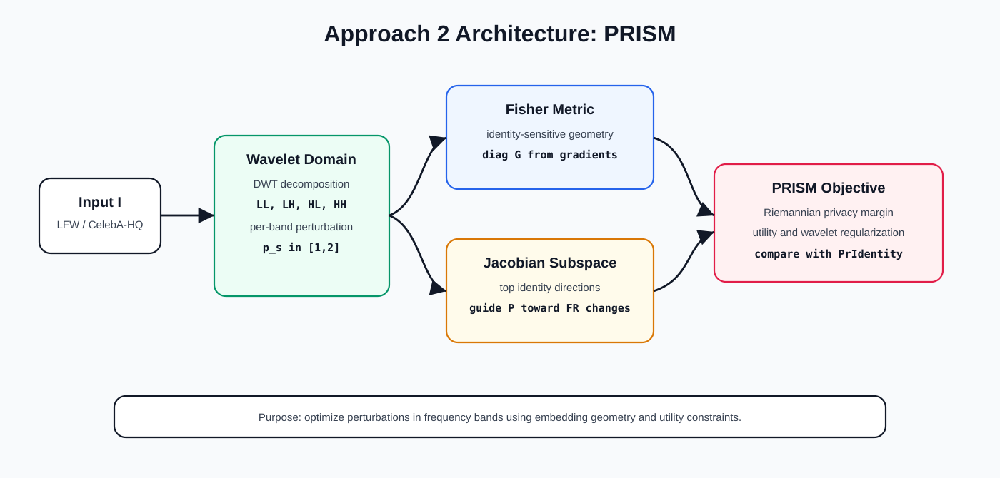

**Figure 8.** PRISM architecture. The method optimizes wavelet-domain perturbations using Riemannian privacy loss and Jacobian identity directions.

### 4.3 Mathematical Formulation

PRISM first decomposes the image into wavelet sub-bands:

$$I \;\rightarrow\; \{LL,\; LH,\; HL,\; HH\}$$

Each sub-band has a perturbation and an adaptive norm parameter:

$$p_s \in [1, 2]$$

The method estimates a diagonal Fisher information metric:

$$G(x) \approx \mathbb{E}\!\left[\nabla_x \log p_\theta(y|x)\;\nabla_x \log p_\theta(y|x)^T\right]$$

The privacy distance becomes geometry-aware:

$$d_R(I, A) = \sqrt{(z_I - z_A)^T\, G\, (z_I - z_A)}$$

The privacy loss is:

$$\mathcal{L}_{\mathrm{priv}} = \max\!\left(0,\; \alpha - d_R(I, A)\right)$$

PRISM also uses Jacobian identity subspaces so the perturbation follows directions that matter to face-recognition embeddings.

### 4.4 Implementation Details

The notebook compares PRISM with the PrIdentity-style baseline on LFW and CelebA-HQ. It evaluates:

| Component | Purpose |
|---|---|
| Wavelet perturbation | Control perturbation by frequency band |
| Fisher metric | Measure identity-sensitive embedding geometry |
| Jacobian subspace | Guide perturbations toward identity directions |
| SSIM and PSNR | Measure visual quality |
| White-box and black-box TPR | Measure privacy |

### 4.5 Visualizations

  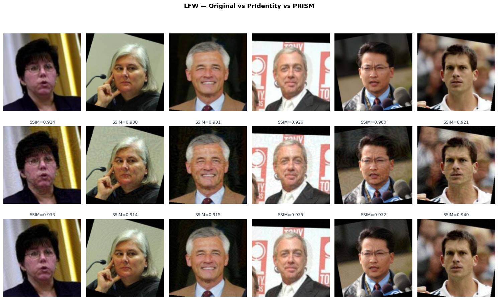

**Figure 9.** PRISM qualitative comparison with original, PrIdentity, and PRISM outputs.

  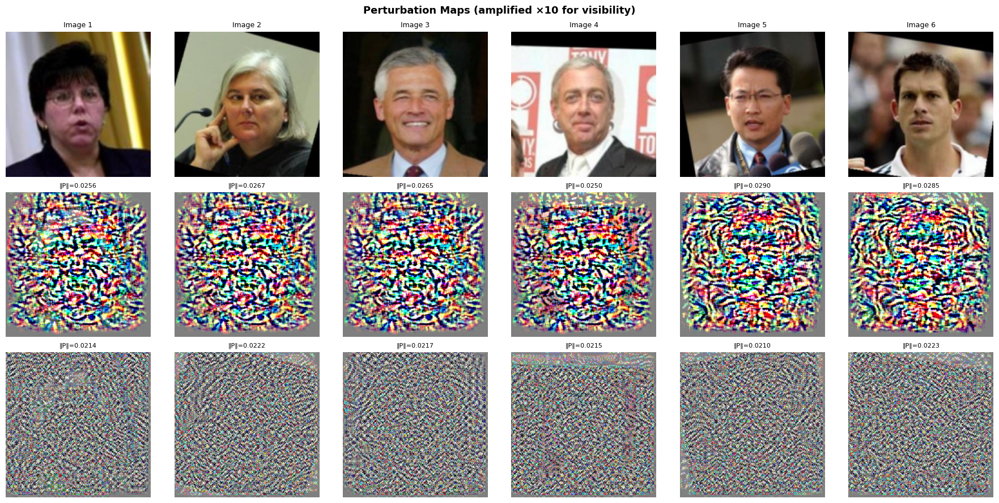

**Figure 10.** PRISM perturbation and frequency analysis.

  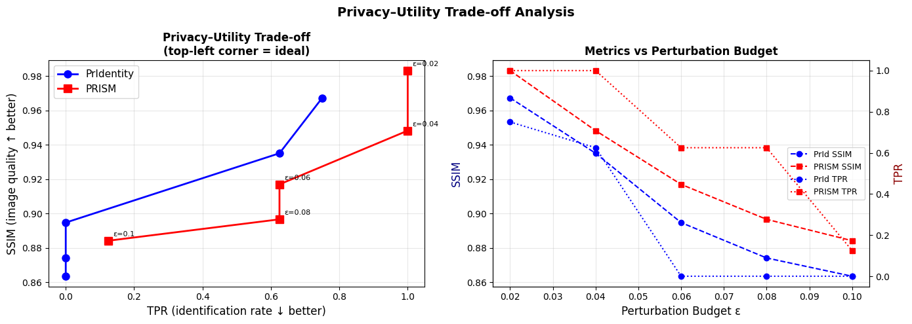

**Figure 12.** Privacy-utility sweep over perturbation budget.

### 4.6 Results

LFW:

| Metric | PrIdentity | PRISM |
|---|---:|---:|
| SSIM ↑ | 0.9194 | 0.9327 |
| PSNR ↑ | 35.84 | 37.36 |
| TPR white-box ↓ | 0.0000 | 0.7833 |
| TPR black-box ↓ | 0.0000 | 0.0167 |
| CosSim white-box ↓ | 0.4753 | 0.7688 |
| CosSim black-box ↓ | 0.4399 | 0.4218 |
| Bounding-box distance ↓ | 0.0778 | 0.0469 |
| T-score ↑ | 0.9194 | 0.2021 |

CelebA-HQ:

| Metric | PrIdentity | PRISM |
|---|---:|---:|
| SSIM ↑ | 0.9325 | 0.9393 |
| PSNR ↑ | 35.64 | 36.97 |
| TPR white-box ↓ | 0.0000 | 0.7833 |
| TPR black-box ↓ | 0.0000 | 0.1333 |
| CosSim white-box ↓ | 0.4794 | 0.7601 |
| CosSim black-box ↓ | 0.4628 | 0.5998 |
| Bounding-box distance ↓ | 0.0301 | 0.0130 |
| T-score ↑ | 0.9325 | 0.2035 |

  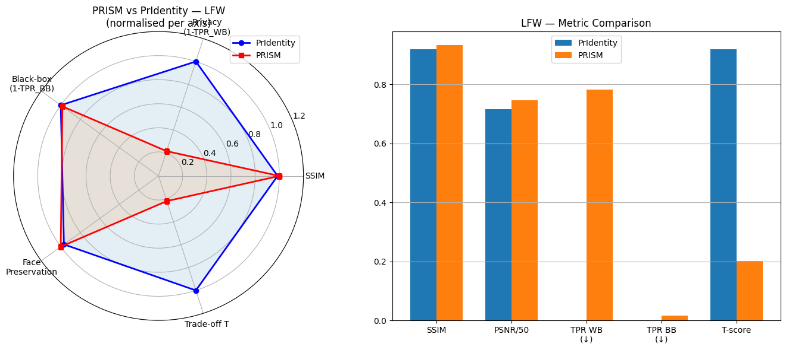

**Figure 13.** Final PRISM comparison using radar and bar plots.

### 4.7 Interpretation

PRISM improves image quality metrics such as SSIM and PSNR. It also provides meaningful frequency and geometry analysis. However, in the recorded experiments it does not suppress white-box identity sufficiently. PRISM is therefore most useful as an analytical and utility-preserving approach, while its privacy objective requires further tuning.

---

## 5. Approach 3: PrimeShield v2

**Notebook:** `t1.ipynb`

### 5.1 Method Overview

PrimeShield v2 was designed to address an earlier failure mode in which cosine similarity remained too high. The revised method directly repels the anonymized embedding from the original embedding and uses a stronger optimization procedure.

The core ideas are:

- use a structured perturbation initialization,
- focus perturbations using a saliency face mask,
- add a prime-residue embedding target,
- optimize with MI-FGSM momentum,
- adapt the privacy and utility norms.

### 5.2 Architecture

  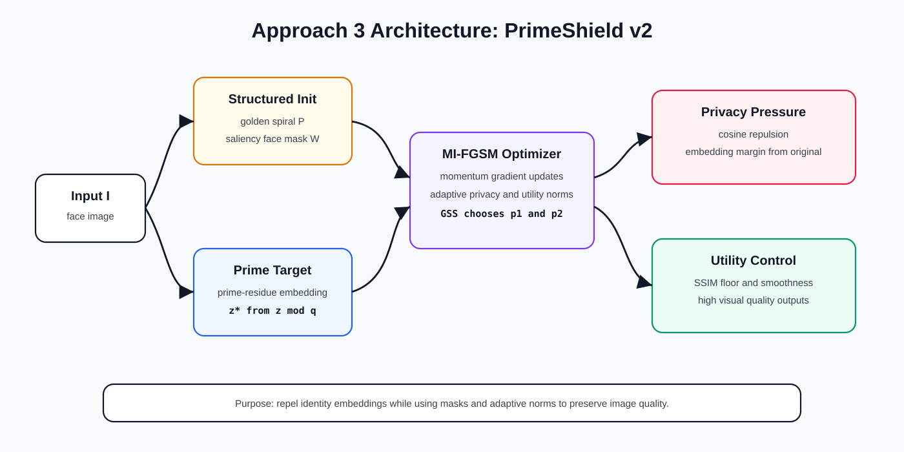

**Figure 14.** PrimeShield v2 architecture. The method combines structured initialization, saliency masking, prime-residue targets, adaptive norms, and MI-FGSM optimization.

### 5.3 Mathematical Formulation

PrimeShield v2 computes an auxiliary prime-residue target from the original embedding:

$$r_i = \lfloor |z_i|\, S \rfloor \bmod q_{i \bmod K}$$

$$z_i^{\star} = 2\,\frac{r_i}{q_i} - 1$$

The anonymized image is:

$$A = \mathrm{clip}(I + P)$$

The method uses a privacy margin in embedding space:

$$\mathcal{L}_{\mathrm{margin}} = \max\!\left(0,\; \alpha - \|z_A - z_I\|_{p_1}\right)$$

It also uses direct cosine repulsion:

$$\mathcal{L}_{\mathrm{cos}} = \left(1 + \cos(z_I, z_A)\right)^2$$

The utility loss keeps the image close to the original:

$$\mathcal{L}_{\mathrm{util}} = \|A - I\|_{p_2}$$

The total objective combines privacy, utility, smoothness, and prime-structure regularization:

$$\mathcal{L} = \lambda_1\,\mathcal{L}_{\mathrm{util}} + \lambda_2\,\mathcal{L}_{\mathrm{margin}} + \lambda_3\,\mathcal{L}_{\mathrm{cos}} + \lambda_4\,\mathcal{L}_{\mathrm{totient}} + \lambda_5\,\mathrm{TV}(P)$$

The optimizer uses momentum iterative FGSM (MI-FGSM):

$$g_{t+1} = \mu\, g_t + \frac{\nabla_P \mathcal{L}}{\|\nabla_P \mathcal{L}\|_1}$$

$$P_{t+1} = P_t + \eta \cdot \mathrm{sign}(g_{t+1})$$

### 5.4 Implementation Details

The notebook evaluates PrimeShield v2 on CelebA-HQ, LFW, and VGGFace2-style generalization. It also includes ablations to show which components improve privacy.

| Component | Purpose |
|---|---|
| Saliency face mask | Protect visually important facial regions |
| Golden spiral initialization | Provide structured perturbation start |
| Prime-residue target | Add a deterministic identity-displacement signal |
| Cosine repulsion | Directly push $z_A$ away from $z_I$ |
| MI-FGSM momentum | Stabilize and strengthen optimization |
| Adaptive $p_1, p_2$ | Balance embedding privacy and image utility |

### 5.5 Visualizations

  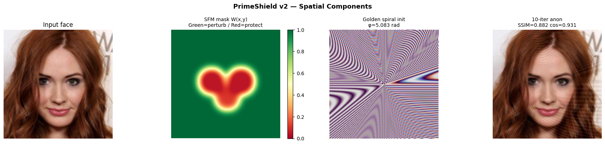

**Figure 15.** PrimeShield v2 components: input image, saliency face mask, spiral initialization, and quick anonymized output.

  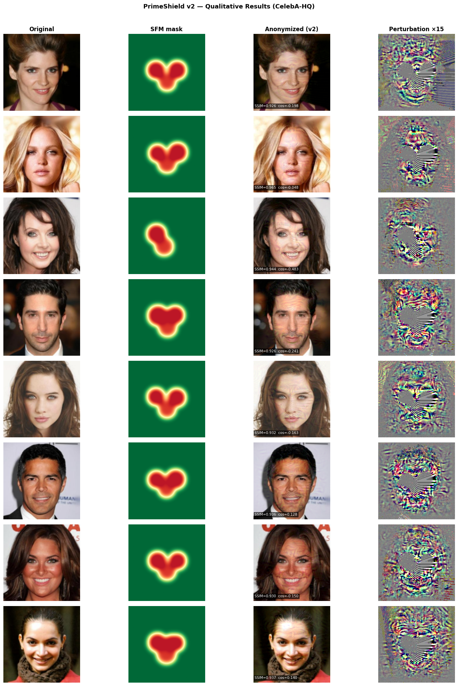

**Figure 16.** Qualitative results showing original images, masks, anonymized images, and amplified perturbations.

  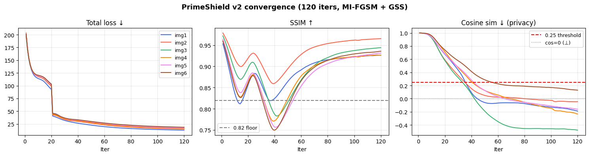

**Figure 17.** Convergence curves. Cosine similarity drops while SSIM remains high.

  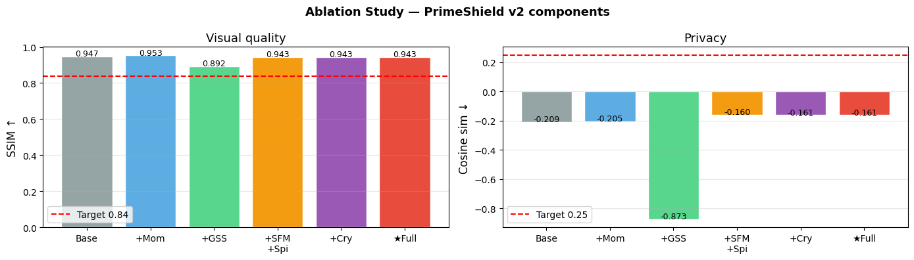

**Figure 18.** Ablation results showing the effect of optimization and masking components.

### 5.6 Results

CelebA-HQ white-box results:

| Metric | PrimeShield v2 |
|---|---:|
| Images | 200 |
| Mean SSIM ↑ | 0.9421 |
| Median SSIM ↑ | 0.9419 |
| Mean cosine similarity ↓ | −0.1820 |
| Privacy rate, cosine $< 0.25$ | 95.0 % |
| Mean L2 distance | 1.5288 |
| Learned $p_1$ for privacy | $1.807 \pm 0.067$ |
| Learned $p_2$ for utility | $1.989 \pm 0.000$ |

LFW verification at FPR $= 0.001$:

| Method | FaceNet/CASIA TPR ↓ | ArcFace/VGGFace2 TPR ↓ | SSIM ↑ |
|---|---:|---:|---:|
| PrIdentity paper | 0.0190 | 0.0020 | 0.8422 |
| PrimeShield v1 | 0.0680 | 0.0090 | 0.9342 |
| **PrimeShield v2** | **0.0600** | **0.0040** | **0.9542** |

VGGFace2 generalization:

| Metric | Result |
|---|---:|
| White-box cosine ↓ | −0.4630 |
| White-box privacy | 99 % |
| Black-box cosine ↓ | 0.6966 |
| Black-box privacy | 0 % |
| SSIM ↑ | 0.9459 |

### 5.7 Interpretation

PrimeShield v2 gives the highest visual quality among the recorded approaches and remains close to PrIdentity on white-box ArcFace TPR. Its main limitation is black-box generalization: the VGGFace2 experiment shows that the anonymized image can still remain similar under a held-out model. The method is effective for white-box privacy and utility, but it needs a stronger ensemble strategy for transfer.

---

## 6. Final Comparison

The table below compares the PrIdentity baseline with the three implemented approaches. Because the notebooks use different datasets and protocols, this table should be read as a project-level summary rather than a perfectly controlled benchmark.

| Method | Main Evaluation | Privacy Result | Utility Result | Main Strength | Main Weakness |
|---|---|---|---|---|---|
| PrIdentity paper | LFW at FPR $= 0.001$ | ArcFace TPR 0.0020 | SSIM 0.8422 | Privacy baseline without target identity | Lower SSIM than PrimeShield v2 |
| Approach 1: Sinusoidal + ArcFace/ResNet | Multi-surrogate cosine test | All 4 tested models had cosine $< 0$ | SSIM 0.8626 | Multi-model cosine suppression | Limited transfer in single-surrogate setting |
| Approach 2: PRISM | LFW and CelebA-HQ comparison | LFW white-box TPR 0.7833 | LFW SSIM 0.9327 | Frequency and geometry analysis | Insufficient identity suppression in current run |
| Approach 3: PrimeShield v2 | LFW and CelebA-HQ | ArcFace TPR 0.0040 | LFW SSIM 0.9542 | Strongest recorded privacy-utility balance | Limited black-box transfer |

---

## 7. Conclusion

This project began with the PrIdentity baseline and explored three different ways to improve or analyze privacy-preserving face perturbations.

Approach 1 shows that smooth sinusoidal initialization and multi-surrogate optimization can reduce cosine similarity across several tested models. Approach 2 shows that frequency-domain and Riemannian tools are useful for understanding perturbation behavior and preserving image quality, but the privacy loss requires further tuning. Approach 3 gives the strongest recorded privacy-utility trade-off by combining adaptive Lp optimization, saliency masking, momentum updates, and direct cosine repulsion.

The main lesson is that face anonymization is not only about adding noise. The perturbation must be structured, identity-aware, and evaluated across multiple recognition models.

---

## 8. Limitations

- The approaches were evaluated using different notebook protocols, so the final comparison is not a fully controlled benchmark.
- Some experiments use small sample sizes because of GPU limits.
- Black-box transfer remains difficult, especially for PrimeShield v2 and the single-surrogate version of Approach 1.
- PRISM preserved image quality but did not achieve sufficient white-box privacy in the recorded run.
- SSIM and PSNR do not fully measure whether humans still perceive the same identity.

---

## 9. Future Work

- Use the same train/test split and verification protocol for all three approaches.
- Add a larger ensemble of face-recognition models during optimization.
- Improve PRISM with stronger privacy margins and better wavelet-band weighting.
- Add semantic face parsing masks instead of heuristic saliency masks.
- Evaluate human identity perception in addition to automated face-recognition metrics.

---

## 10. Repository Files

| File | Purpose |
|---|---|
| `PrIdentity_Generalizable_Privacy-Preserving_Adversarial_Perturbations_for_Anonymizing_Facial_Identity.pdf` | Baseline paper |
| `sin+arcface+resnet.ipynb` | Approach 1 notebook |
| `prism-face-anonymization (2).ipynb` | Approach 2 notebook |
| `t1.ipynb` | Approach 3 notebook |
| `Face_Anonymisation_Report.docx` | Supporting report |
| `assets/` | Extracted notebook figures and architecture diagrams |

---

## References

Chhabra, S., Thakral, K., Singh, R., and Vatsa, M. **PrIdentity: Generalizable Privacy-Preserving Adversarial Perturbations for Anonymizing Facial Identity.** IEEE Transactions on Biometrics, Behavior, and Identity Science, 2026.

Deng, J. et al. **ArcFace: Additive Angular Margin Loss for Deep Face Recognition.**

Zhang, R. et al. **The Unreasonable Effectiveness of Deep Features as a Perceptual Metric.**

Schroff, F. et al. **FaceNet: A Unified Embedding for Face Recognition and Clustering.**